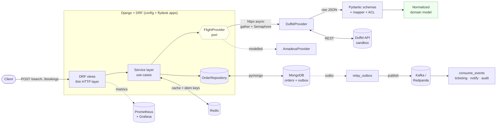

# FlyDesk ✈️

[](https://github.com/Kuber-code/FlyDesk/actions/workflows/ci.yml)

**A provider-agnostic flight search & booking backend for corporate travel.**

Search flights across multiple providers, normalize the messy responses into one
clean model, and book against a sandbox with idempotency and a clear
`pending → confirmed` lifecycle. Built as a focused, runnable demonstration of a
modern async-capable Python microservice stack: **Django + DRF, Pydantic v2,
MongoDB, httpx**, with **Duffel** wired live and **Amadeus** modelled.

> All four phases are built: a synchronous Phase 1 core, plus async + Redis +
> resilience (Phase 2), Kafka + saga + outbox (Phase 3), and observability + CI/CD
> (Phase 4). Each phase layered onto the same seams without a rewrite. See the
> [roadmap](#roadmap).

---

## Why this project

It implements the canonical travel-platform flow — **shop → price → book → (ticket)**
— the way a real corporate travel management platform would, and it's honest about
the ecosystem: Amadeus is retiring its public Self-Service portal mid-2026, so the
live integration targets **Duffel's** sandbox while the **Amadeus domain is modelled**
behind the same interface. That "provider-agnostic, but I understand the GDS domain"
posture is the whole point.

## Architecture



- **DRF views** validate the HTTP shape and stay thin.
- **Service layer** holds the use-cases (`search_offers`, `create_booking`), now
  with an **async concurrent fan-out** (`gather` + `Semaphore` + per-provider
  `timeout`), a **circuit breaker**, and **Redis** (offer cache + idempotency-key
  reservation).
- **`FlightProvider` port** decouples the app from any specific GDS.
- **Pydantic ACL** (anti-corruption layer) parses raw provider payloads and maps
  them to one normalized domain model.
- **`OrderRepository`** persists orders to MongoDB as embedded documents, with a
  **transactional outbox** embedded in the order; `relay_outbox` publishes to
  **Kafka/Redpanda** and `consume_events` runs the idempotent
  ticketing/notifications/audit consumers (plus the booking **saga**).
- **Observability**: Prometheus `/metrics` + a Grafana dashboard, structured JSON
  logs with correlation IDs, PII-scrubbed Sentry.

This single design touches every technology in the role — Django, Mongo, Pydantic,
async, Redis, Kafka/streaming, and observability.

## Tech stack

| Concern | Choice | Notes |
|---|---|---|
| Web framework / API | **Django 5 + DRF** | routing, validation, admin; async search path |
| Validation / domain | **Pydantic v2** + pydantic-settings | anti-corruption layer + typed config |
| HTTP client | **httpx** | one reused client; async concurrent fan-out in search |
| Datastore (domain) | **MongoDB** via pymongo | orders as embedded documents, repository pattern |
| Datastore (Django) | SQLite | auth/sessions/admin only |
| Cache / coordination | **Redis** | offer cache (TTL) + idempotency-key reservation (SETNX) |
| Streaming | **Kafka** (Redpanda) | transactional outbox → relay → idempotent consumers |
| Observability | **Prometheus + Grafana**, Sentry | `/metrics`, dashboard, JSON logs + correlation IDs, PII-scrubbed errors |
| Live provider | **Duffel** sandbox | `duffel_test_` token |
| Modelled provider | **Amadeus** | schemas + mapper, no live calls |
| Tests | pytest, respx, mongomock | mock at the transport boundary |
| Tooling | ruff, black | lint + format |

## Repository layout

```
flydesk/
  common/        config (pydantic-settings), mongo client, middleware, exceptions
  domain/        normalized Pydantic models + enums (provider-agnostic)
  providers/
    base.py      FlightProvider port + get_provider() factory
    duffel/      schemas (raw) + mapper (ACL) + client (live, httpx)
    amadeus/     schemas (raw) + mapper (ACL) + provider (modelled stub)
  search/        DRF app: POST /search  (async fan-out + Redis cache)
  bookings/      DRF app: POST /bookings, GET /bookings/{id} (+ Mongo repository, outbox)
  events/        outbox relay, Kafka publisher, idempotent consumers (Phase 3)
config/          Django project (settings, urls, wsgi/asgi)
tests/           unit + integration; fixtures/ holds real provider payloads
docs/adr/        Architecture Decision Records
docs/DEPLOYMENT.md   how to run, ship, and deploy (+ the phased build plan)
```

## Quickstart

### Prerequisites
- Python 3.12+
- A free Duffel sandbox token (`duffel_test_…`) from <https://app.duffel.com> —
  optional; you can run the tests and the Amadeus mapper with no token at all.
- For live search/booking: MongoDB (use Docker, below) and the token.

### Option A — Docker (everything)
```bash
cp .env.example .env        # put your duffel_test_ token in DUFFEL_API_TOKEN
docker compose up --build   # full stack
```
Brings up: API on `:8000`, **Grafana** `:3000` (anonymous, FlyDesk dashboard),
**Prometheus** `:9090`, Mongo, Redis, Redpanda (Kafka), plus the `relay` and
`worker` (outbox relay + consumers). App metrics at `:8000/metrics`.

### Option B — local venv
```bash
python -m venv .venv && . .venv/Scripts/activate    # PowerShell: .venv\Scripts\Activate.ps1
pip install -r requirements-dev.txt
cp .env.example .env                                # add your token
# start a Mongo (e.g. docker run -p 27017:27017 mongo:7), then:
python manage.py migrate
python manage.py runserver
```

### Try it
```bash
# Health
curl localhost:8000/healthz

# Search (returns normalized offers, cheapest first)
curl -s localhost:8000/api/v1/search -H 'Content-Type: application/json' -d '{
  "origin": "LHR", "destination": "JFK", "departure_date": "2026-08-15",
  "cabin_class": "economy", "passengers": [{"type": "adult"}]
}'

# Book an offer (idempotent — repeat with the same key, get the same order)
curl -s localhost:8000/api/v1/bookings \
  -H 'Content-Type: application/json' -H 'Idempotency-Key: 2f9a…' -d '{
  "offer_id": "off_…",
  "passengers": [{"given_name":"Tony","family_name":"Stark","born_on":"1980-07-24",
    "email":"tony@stark.com","phone_number":"+442080160508"}]
}'

# Fetch a booking
curl -s localhost:8000/api/v1/bookings/ord_…
```

A normalized offer looks like:
```json
{
  "id": "off_0000DirectBA01", "provider": "duffel",
  "owner": {"iata_code": "BA", "name": "British Airways"},
  "total": {"amount": "412.40", "currency": "GBP"},
  "total_stops": 0, "cabin_class": "economy",
  "slices": [{ "origin": {"iata_code":"LHR"}, "destination": {"iata_code":"JFK"},
    "stops": 0, "segments": [{ "flight_number":"BA175", "aircraft":"Boeing 777-300ER" }] }]
}
```

## The Pydantic exercise

`tests/fixtures/` holds **real-shaped Duffel and Amadeus payloads** and a
[guided exercise](tests/fixtures/README.md). The two providers are deliberately
different (snake_case vs camelCase, inline names vs a `dictionaries` block, cabin
in different places) — flattening both into the same `Offer` is how you internalize
why the anti-corruption layer exists. Reference solutions:
```bash
pytest tests/test_duffel_mapper.py tests/test_amadeus_mapper.py -v
```

## Resilience

Search fans out to every provider concurrently and is built to **degrade, not
fail**: one slow or broken provider never sinks the whole response.

- **Concurrent fan-out with isolation** — `asyncio.gather` over the providers, each
  under its own `asyncio.timeout` and a `Semaphore` bound. A provider that times out
  or raises is dropped from the result and reported in a `degraded` list; the
  healthy providers' offers still come back, merged and sorted cheapest-first.
- **Circuit breaker** — repeated failures to a provider trip the breaker `open`, so
  subsequent calls **fail fast** instead of piling onto a struggling dependency;
  after a cooldown it goes `half_open` and closes again on the next success.
- **Retry with backoff + jitter** around transient errors (timeouts), giving up
  after a bounded number of attempts rather than hanging.

It's proven by tests, not just asserted:

| Behaviour | Test |
|---|---|
| Slow provider times out, the rest still return | [`test_async_search.py`](tests/test_async_search.py) `test_slow_provider_times_out_others_still_return` |
| Failing provider degrades gracefully (`degraded == ["broken"]`) | [`test_async_search.py`](tests/test_async_search.py) `test_failing_provider_degrades_gracefully` |
| Breaker opens after threshold, then fails fast | [`test_resilience.py`](tests/test_resilience.py) `test_breaker_opens_after_threshold_then_fails_fast` |
| Breaker half-opens after cooldown and closes on success | [`test_resilience.py`](tests/test_resilience.py) `test_breaker_half_opens_and_closes_on_success` |
| Retry succeeds after transient failures / gives up | [`test_resilience.py`](tests/test_resilience.py) `test_retry_*` |

Degradations are also a Prometheus counter (`flydesk_provider_degraded_total`) with
a Grafana panel, so a flaky provider shows up on the dashboard, not just in logs.

## Design decisions (with trade-offs)

Short ADRs in [`docs/adr/`](docs/adr/):
1. [Provider abstraction](docs/adr/0001-provider-abstraction.md) — one port, Duffel live + Amadeus modelled.
2. [Pydantic anti-corruption layer](docs/adr/0002-pydantic-anti-corruption-layer.md) — tame messy GDS payloads at the edge.
3. [MongoDB via a repository](docs/adr/0003-mongodb-via-repository.md) — Django for HTTP, Mongo for documents, no ORM bridge.
4. [Idempotent bookings](docs/adr/0004-idempotent-bookings.md) — never double-book a non-idempotent write.
5. [Outbox & idempotent consumers](docs/adr/0005-outbox-and-idempotent-consumers.md) — atomic outbox + relay, duplicate events as no-ops.
6. [Booking saga](docs/adr/0006-booking-saga.md) — reserve → pay → ticket with compensation on failure.
7. [Observability](docs/adr/0007-observability.md) — Prometheus/Grafana, JSON logs + correlation IDs, PII-scrubbed Sentry.

## Testing
```bash
pytest                 # 47 hermetic tests: domain, both mappers, provider, async search, resilience, cache, booking saga, outbox/consumers, observability
ruff check . && black --check .
python manage.py check

pytest -m integration  # opt-in: real MongoDB via testcontainers (needs Docker)
```
External HTTP is mocked at the transport boundary with **respx**; MongoDB is faked
with **mongomock** and Redis with **fakeredis**, so the default suite runs offline
in under a second. On top of that, an opt-in **testcontainers** layer
([`tests/test_integration_mongo.py`](tests/test_integration_mongo.py)) runs the
repository against a real `mongod` — proving the unique-index idempotency guard
actually rejects a duplicate (something mongomock can't enforce). It's excluded
from the default run and gets its own CI job.

## Roadmap

| Phase | Adds | Closes (from the role) |
|---|---|---|
| **1 ✅ (this repo)** | Django+DRF, Pydantic ACL, Mongo, Duffel live, Amadeus modelled, idempotency | Django, Mongo, Pydantic, travel domain |
| **2 ✅** | async concurrent fan-out (`gather` + `Semaphore` + per-provider `timeout`, graceful degradation), **Redis** offer-cache + idempotency reservation (SETNX), **circuit breaker** + retry/backoff+jitter | async, Redis, resilience |
| **3 ✅** | **outbox** (embedded in the order doc, atomic with the write) + **relay** → Kafka/Redpanda; 3 **idempotent consumers** (ticketing/notifications/audit); **booking saga** (reserve→pay→ticket) with compensation | Kafka/streaming, distributed-systems patterns |
| **4 ✅** | **Prometheus** `/metrics` (HTTP + domain counters) + **Grafana** dashboard, **structured JSON logs** with correlation IDs, **Sentry** (PII-scrubbed); GitHub Actions CI green since Phase 1 | observability, CI/CD |

## How AI assistants were used

Scaffolding, the repetitive mapper/test code, and first-draft docs were generated
with an AI coding assistant, then reviewed line-by-line and held to the same bar as
hand-written code: every payload field checked against provider docs, every mapper
covered by a test asserting the **normalized** output, and the suite + linters green
before commit. AI as a force multiplier on top of knowing what "correct" looks like.

## License
MIT — see `pyproject.toml`. Sample payloads are representative sandbox shapes for
learning, not proprietary data.
