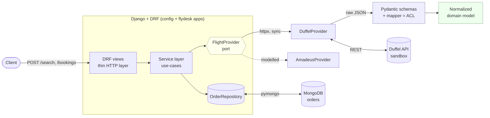

# FlyDesk ✈️

**A provider-agnostic flight search & booking backend for corporate travel.**

Search flights across multiple providers, normalize the messy responses into one
clean model, and book against a sandbox with idempotency and a clear
`pending → confirmed` lifecycle. Built as a focused, runnable demonstration of a
modern async-capable Python microservice stack: **Django + DRF, Pydantic v2,
MongoDB, httpx**, with **Duffel** wired live and **Amadeus** modelled.

> This is **Phase 1** — deliberately synchronous and complete on its own. The
> repo is structured so Phases 2–4 (async + Redis + resilience, Kafka + saga +
> outbox, observability + CI/CD) slot in without a rewrite. See the [roadmap](#roadmap).

---

## Why this project

It implements the canonical travel-platform flow — **shop → price → book → (ticket)**
— the way a real corporate travel management platform would, and it's honest about
the ecosystem: Amadeus is retiring its public Self-Service portal mid-2026, so the
live integration targets **Duffel's** sandbox while the **Amadeus domain is modelled**
behind the same interface. That "provider-agnostic, but I understand the GDS domain"
posture is the whole point.

## Architecture (Phase 1)



- **DRF views** validate the HTTP shape and stay thin.
- **Service layer** holds the use-cases (`search_offers`, `create_booking`).
- **`FlightProvider` port** decouples the app from any specific GDS.
- **Pydantic ACL** (anti-corruption layer) parses raw provider payloads and maps
  them to one normalized domain model.
- **`OrderRepository`** persists orders to MongoDB as embedded documents.

The **target architecture** (all phases) adds a separate async Search service,
Redis, Kafka with consumers (ticketing/notifications/audit), and observability —
this single design touches every technology in the role.

## Tech stack

| Concern | Choice | Notes |
|---|---|---|
| Web framework / API | **Django 5 + DRF** | routing, validation, admin; async views land in Phase 2 |
| Validation / domain | **Pydantic v2** + pydantic-settings | anti-corruption layer + typed config |
| HTTP client | **httpx** (sync) | one reused client; async in Phase 2 |
| Datastore (domain) | **MongoDB** via pymongo | orders as embedded documents, repository pattern |
| Datastore (Django) | SQLite | auth/sessions/admin only |
| Live provider | **Duffel** sandbox | `duffel_test_` token |
| Modelled provider | **Amadeus** | schemas + mapper, no live calls |
| Tests | pytest, respx, mongomock | mock at the transport boundary |
| Tooling | ruff, black | lint + format |

## Repository layout

```
flydesk/
  common/        config (pydantic-settings), mongo client, middleware, exceptions
  domain/        normalized Pydantic models + enums (provider-agnostic)
  providers/
    base.py      FlightProvider port + get_provider() factory
    duffel/      schemas (raw) + mapper (ACL) + client (live, httpx)
    amadeus/     schemas (raw) + mapper (ACL) + provider (modelled stub)
  search/        DRF app: POST /search  (view → service → provider)
  bookings/      DRF app: POST /bookings, GET /bookings/{id} (+ Mongo repository)
config/          Django project (settings, urls, wsgi/asgi)
tests/           unit + integration; fixtures/ holds real provider payloads
docs/adr/        Architecture Decision Records
docs/DEPLOYMENT.md   how to run, ship, and deploy (+ the phased build plan)
```

## Quickstart

### Prerequisites
- Python 3.12+
- A free Duffel sandbox token (`duffel_test_…`) from <https://app.duffel.com> —
  optional; you can run the tests and the Amadeus mapper with no token at all.
- For live search/booking: MongoDB (use Docker, below) and the token.

### Option A — Docker (everything)
```bash
cp .env.example .env        # put your duffel_test_ token in DUFFEL_API_TOKEN
docker compose up --build   # Mongo + Django on http://localhost:8000
```

### Option B — local venv
```bash
python -m venv .venv && . .venv/Scripts/activate    # PowerShell: .venv\Scripts\Activate.ps1
pip install -r requirements-dev.txt
cp .env.example .env                                # add your token
# start a Mongo (e.g. docker run -p 27017:27017 mongo:7), then:
python manage.py migrate
python manage.py runserver
```

### Try it
```bash
# Health
curl localhost:8000/healthz

# Search (returns normalized offers, cheapest first)
curl -s localhost:8000/api/v1/search -H 'Content-Type: application/json' -d '{
  "origin": "LHR", "destination": "JFK", "departure_date": "2026-08-15",
  "cabin_class": "economy", "passengers": [{"type": "adult"}]
}'

# Book an offer (idempotent — repeat with the same key, get the same order)
curl -s localhost:8000/api/v1/bookings \
  -H 'Content-Type: application/json' -H 'Idempotency-Key: 2f9a…' -d '{
  "offer_id": "off_…",
  "passengers": [{"given_name":"Tony","family_name":"Stark","born_on":"1980-07-24",
    "email":"tony@stark.com","phone_number":"+442080160508"}]
}'

# Fetch a booking
curl -s localhost:8000/api/v1/bookings/ord_…
```

A normalized offer looks like:
```json
{
  "id": "off_0000DirectBA01", "provider": "duffel",
  "owner": {"iata_code": "BA", "name": "British Airways"},
  "total": {"amount": "412.40", "currency": "GBP"},
  "total_stops": 0, "cabin_class": "economy",
  "slices": [{ "origin": {"iata_code":"LHR"}, "destination": {"iata_code":"JFK"},
    "stops": 0, "segments": [{ "flight_number":"BA175", "aircraft":"Boeing 777-300ER" }] }]
}
```

## The Pydantic exercise

`tests/fixtures/` holds **real-shaped Duffel and Amadeus payloads** and a
[guided exercise](tests/fixtures/README.md). The two providers are deliberately
different (snake_case vs camelCase, inline names vs a `dictionaries` block, cabin
in different places) — flattening both into the same `Offer` is how you internalize
why the anti-corruption layer exists. Reference solutions:
```bash
pytest tests/test_duffel_mapper.py tests/test_amadeus_mapper.py -v
```

## Design decisions (with trade-offs)

Short ADRs in [`docs/adr/`](docs/adr/):
1. [Provider abstraction](docs/adr/0001-provider-abstraction.md) — one port, Duffel live + Amadeus modelled.
2. [Pydantic anti-corruption layer](docs/adr/0002-pydantic-anti-corruption-layer.md) — tame messy GDS payloads at the edge.
3. [MongoDB via a repository](docs/adr/0003-mongodb-via-repository.md) — Django for HTTP, Mongo for documents, no ORM bridge.
4. [Idempotent bookings](docs/adr/0004-idempotent-bookings.md) — never double-book a non-idempotent write.

## Testing
```bash
pytest                 # 23 tests: domain, both mappers, provider (respx), booking flow, endpoint
ruff check . && black --check .
python manage.py check
```
External HTTP is mocked at the transport boundary with **respx**; MongoDB is faked
with **mongomock**, so the whole suite runs offline in under a second. Phase 4
swaps the fakes for **testcontainers** on the integration tests.

## Roadmap

| Phase | Adds | Closes (from the role) |
|---|---|---|
| **1 ✅ (this repo)** | Django+DRF, Pydantic ACL, Mongo, Duffel live, Amadeus modelled, idempotency | Django, Mongo, Pydantic, travel domain |
| **2** | async Search service (asyncio + httpx/aiohttp, semaphores, timeouts), Redis (offer cache TTL, idempotency reservation, rate-limit), retries + circuit breaker | async, Redis, resilience |
| **3** | Kafka `BookingConfirmed` → ticketing/notifications/audit consumers, **outbox**, **saga** with compensation | Kafka/streaming, distributed-systems patterns |
| **4** | Sentry (PII-scrubbed), Prometheus/Grafana (latency, error rate, consumer lag), correlation IDs in structured logs, GitHub Actions + testcontainers | observability, CI/CD |

## How AI assistants were used

Scaffolding, the repetitive mapper/test code, and first-draft docs were generated
with an AI coding assistant, then reviewed line-by-line and held to the same bar as
hand-written code: every payload field checked against provider docs, every mapper
covered by a test asserting the **normalized** output, and the suite + linters green
before commit. AI as a force multiplier on top of knowing what "correct" looks like.

## License
MIT — see `pyproject.toml`. Sample payloads are representative sandbox shapes for
learning, not proprietary data.
